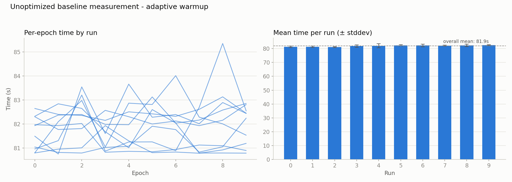

# axon

A neural network library from scratch in C++.

## roadmap

- [X] Tensor class
- [X] Autograd
- [X] basic Modules
- [X] Optimizers (SGD)
- [X] first test - model (XOR)
- [X] first real model MNIST
- [ ] performance benchmarks
- [ ] Code optimization
- [ ] Code parallelization
- [ ] addition of more modules

## XOR (`examples/xor_demo.cpp`) results

**Setup:** A 2-4-1 MLP (`Linear(2,4) → ReLU → Linear(4,1)`) trained on all four
XOR samples (full-batch) for 1000 epochs with SGD (learning rate 0.1) against
the mean-squared error.

```
./build/examples/xor
Epoch: 0; loss:0.522413; acc.:0.5
Epoch: 100; loss:0.0178309; acc.:1
Epoch: 200; loss:0.000173242; acc.:1
Epoch: 300; loss:1.57907e-06; acc.:1
Epoch: 400; loss:1.41426e-08; acc.:1
Epoch: 500; loss:1.26356e-10; acc.:1
Epoch: 600; loss:1.56431e-12; acc.:1
Epoch: 700; loss:6.14889e-13; acc.:1
Epoch: 800; loss:4.01639e-13; acc.:1
Epoch: 900; loss:3.23491e-13; acc.:1
```

**Interpretation:**

- The model reaches **100 % accuracy by epoch 100** and drives the loss down by
  roughly **twelve orders of magnitude**, flattening near `~1e-13` — the
  effective precision floor of 32-bit floats.
- XOR is **not linearly separable**, so fitting it requires the hidden ReLU
  layer. Successfully learning it end-to-end validates that the full pipeline —
  tensor ops, autograd/backprop, and the SGD update — works correctly.

**Caveats:**

- Weights are initialized from `std::random_device` (see `Linear`), so the exact
  loss values vary between runs; the convergence behavior does not.
- This is a **correctness check, not a generalization benchmark**: with only four
  samples and no train/test split, the network simply memorizes the truth table.
  Measuring real generalization is what the MNIST roadmap item is for.

## MNIST – Performance benchmark

Sequential model: Linear(784, 128) -> ReLU -> Linear (128,10), trained with SGD.

| Metric                                    | Value                     |
|-------------------------------------------|---------------------------|
| Parameters                                | 101,770                   |
| Training images                           | 60,000 (28×28)            |
| FLOPs per epoch                           | ≈ 36.6 GFLOP              |
| Throughput (unoptimized, single-threaded) | ≈ 13.5 MFLOP/s            |

Getting to a trustworthy baseline throughput number took three iterations to
correctly account for CPU thermal warm-up effects on the benchmark machine —
see [`docs/devlog/001-mnist-warmup-calibration.md`](docs/devlog/001-mnist-warmup-calibration.md)
for the full investigation (setup, FLOP derivation, plots, and reasoning
behind each iteration).



Further optimization and parallelization work is tracked in
[`docs/`](docs/README.md).
