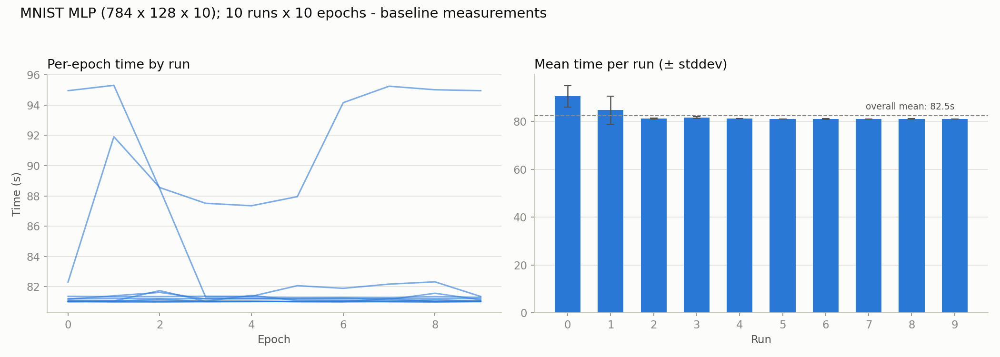
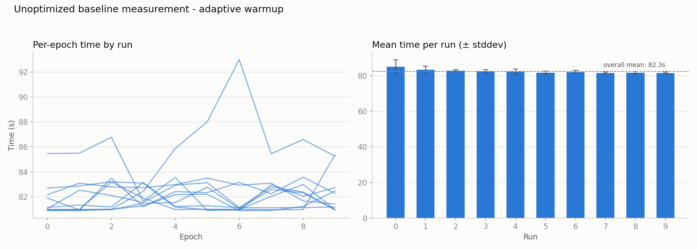

# 001 – MNIST benchmark: warmup calibration

**Period:** 2026-07-09 – 2026-07-15
**Commits:** `3bb5b8e`, `12094ac`, `3b9e3ec`

## Goal

Before starting the actual code optimization work, a reliable baseline
measurement for the unoptimized, single-threaded MNIST training run is
needed. These three iterations document how a simple fixed warmup turned out
to be insufficient for that, and how the measurement methodology was
adjusted accordingly.

## Setup

Sequential model: Linear(784, 128) -> ReLU -> Linear (128,10)
Optimizer: SGD

| Metric                                    | Value                     |
|-------------------------------------------|---------------------------|
| Parameters                                | 101,770                   |
| Training images                           | 60,000 (28×28)            |
| Batch size                                | 32 → 1,875 batches/epoch  |
| FLOPs per sample (fwd+bwd)                | ≈ 0.61 MFLOP              |
| FLOPs per epoch                           | ≈ 36.6 GFLOP              |
| FLOPs per run (5 epochs)                  | ≈ 183 GFLOP               |
| Total FLOPs (5 runs + warmup)             | ≈ 952 GFLOP (~0.95 TFLOP) |
| Throughput (unoptimized, single-threaded) | ≈ 13.5 MFLOP/s            |

*FLOPs estimated using the standard approximation for fully connected
layers: forward ≈ 2·B·in·out (+ bias), backward ≈ 4·B·in·out
(grad_input + grad_weight, + bias gradient); ReLU/loss are negligible.*

## Iteration 1: Unoptimized baseline (`3bb5b8e`, 2026-07-09)

The plot clearly shows that the current warm-up phase is not enough: runs 0 and 1
are both noticeably slower (≈90 s and ≈84 s mean epoch time) and more variable
(larger stddev) than runs 2–9, which settle into a stable ≈81 s baseline.

Looking at the per-epoch trace, the anomaly is *not* a simple monotonic
cold-cache warm-up: epoch 0 of run 0 (≈82 s) is actually among the fastest
epochs measured, times then climb to ≈95 s over the rest of run 0, stay
elevated through the first two epochs of run 1, and only then drop sharply to
the stable ≈81 s baseline that holds for the remaining ~8 runs. That
fast → slow → stable shape points less at classic cache/allocator warm-up
and more at CPU power-state transients (e.g., an initial turboboost burst
followed by thermal throttling under sustained load, before the clock settles
into a steady state) — the anomaly spans roughly 13 epochs, i.e. ~19 minutes
of continuous load, which lines up with typical laptop thermal ramp-up time.

**Conclusion:** The single untimed warm-up epoch is nowhere near enough to
reach a steady state, and a fixed "discard N runs" rule is a rough
approximation since the transition doesn't align cleanly with a run boundary.
For now, excluding runs 0 and 1 from the aggregated statistics is a
reasonable and simple correction to get a representative throughput number.
Longer term, the warm-up should be convergence-based (run until several
consecutive epochs land within a small tolerance of each other, e.g., ±2%)
rather than a fixed epoch count. It would be worth logging CPU
frequency/temperature (e.g., via `powermetrics` on macOS) alongside the
timings to confirm the throttling hypothesis. Pinning the benchmark process
to performance cores or disabling frequency scaling would also make
comparisons from future optimization before/after work less noisy.

## Iteration 2: Adaptive warmup (`12094ac`, 2026-07-13)

The runtime graph of the first run with adaptive warmup points out well that the warmup still didn't fix the problem.
It appears that the warm-up phase converged on a coincidental early plateau
rather than the true steady state: `warmup.csv` shows only three epochs
(≈81.4 s, ≈81.5 s, ≈81.5 s — a spread of ~0.13 %, well inside the ±2 %
tolerance) before the convergence check declared the system stable. The
measured runs that follow tell a different story: run 0 stays low for its
first three epochs (~81 s) and then climbs to a peak of ≈93.0 s at epoch 6,
before settling back down; run 1 is still elevated for its first three
epochs (~85.5–86.8 s) before dropping to the ~81–83 s baseline that holds
from run 2 onward. The thermal ramp-up simply happened to pause briefly
around the point where the warm-up loop was sampling, then resumed — a
short 3-epoch window landed inside that pause and mistook it for the end of
the transient.

**Conclusion:** A short convergence window is not robust against a
non-monotonic warm-up curve — it can be satisfied by chance during a
temporary lull, before the real thermal ramp has even started. Since the
empirical ramp-up in the earlier fixed-warmup measurement spanned ~13
epochs, the adaptive warm-up now enforces a `MIN_WARMUP_EPOCHS` floor (12)
below which convergence isn't checked at all, and the window was widened
from 3 to 5 epochs to make a coincidental plateau less likely to trigger a
false positive. This should be re-validated with another overnight run
before being trusted as the final warm-up strategy.

## Iteration 3: Fixed adaptive warmup with `MIN_WARMUP_EPOCHS` (`3b9e3ec`, 2026-07-15)

## Conclusion / next steps

The adaptive warmup strategy with the `MIN_WARMUP_EPOCHS` floor now serves as
the stable baseline measurement methodology for before/after comparisons in
upcoming optimization work. Future optimization iterations (loop order in
`matmul`, vectorization, parallelization, …) will be tracked as their own
devlog entries under this numbering.