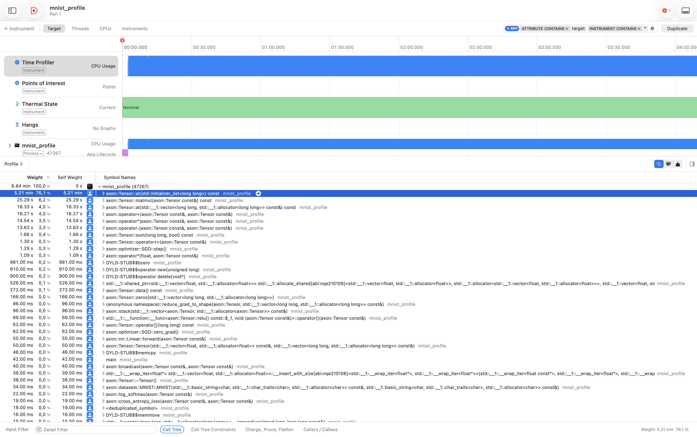
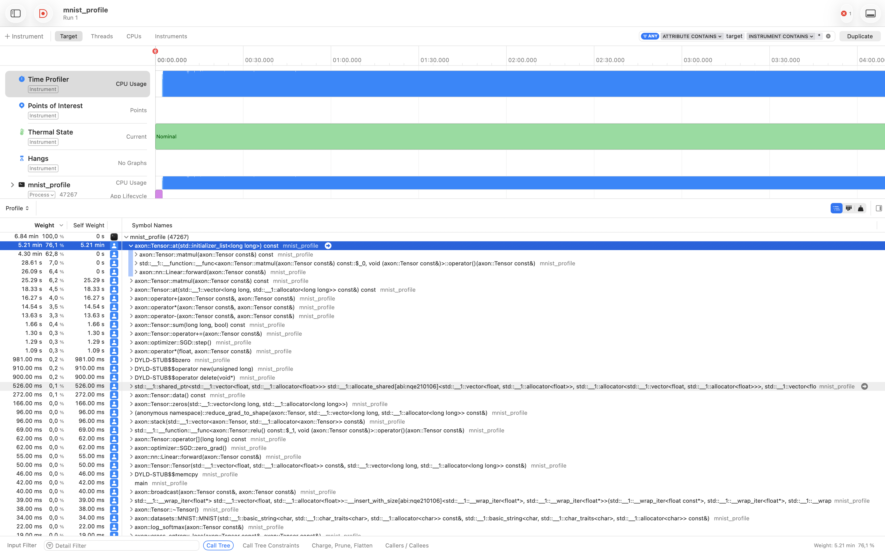

# 002 – Profiling: identifying the matmul/at() hotspot

**Period:** 2026-07-18
**Commit(s):** `6ebda45`, `a80db57`

## Goal

Before starting the actual `matmul` optimization, confirm empirically where the
unoptimized MNIST training loop actually spends its time using a sampling
profiler, rather than optimizing based on code-reading assumptions alone.

## Setup

- Dedicated profiling harness [`benchmarks/mnist/mnist_profile.cpp`](../../benchmarks/mnist/mnist_profile.cpp)
  (no timing/CSV output, just a fixed small number of epochs of the plain
  training loop) — see commit `6ebda45`.
- Profiled with Xcode Instruments' Time Profiler via `xctrace`:
  ```
  caffeinate -i xcrun xctrace record --template 'Time Profiler' \
    --output benchmarks/mnist/profiles/mnist_profile.trace \
    --launch -- ./build/benchmarks/mnist_profile
  ```
- Raw `.trace` output is gitignored (`benchmarks/mnist/profiles/`, see
  `a80db57`) — only the derived findings below are kept.
- Analysis via Instruments' **inverted** call tree, which aggregates
  self-time per function across all call sites, rather than per call-path
  (the plain top-down tree would split the same function's cost across every
  place it's called from).

## Result



A single function, `Tensor::at(std::initializer_list<long long>) const`,
accounts for **5.21 min / 76.1 %** of total runtime — while `Tensor::matmul`
itself has only 25.29 s / 6.2 % self-time.



Breaking down the callers of `at()`:

| Caller                       | Share of total runtime |
|-------------------------------|------------------------|
| `matmul(...)`                 | 62.8 %                 |
| `matmul`'s backward lambda    | 7.0 %                  |
| `Linear::forward`             | 6.4 %                  |
| **Total**                      | **76.2 %**             |

## Interpretation

`matmul` (`src/tensor.cpp:334`) computes each output element via a naive
triple loop that calls `at({i,k})` and `other.at({k,j})` for every scalar
multiply-add. Each `at()` call performs shape validation, per-dimension
stride arithmetic, and bounds checking — none of which is amortized across
the O(rows·cols·inner) inner-loop iterations.

The three separate caller entries for `at()` (rather than one clean `matmul`
entry) are an artifact of `-O3` inlining: the compiler inlines parts of
`matmul` differently depending on the call site (the direct call from
`Linear::forward` vs. the two calls inside the backward lambda), which
flattens the call stack inconsistently for the sampler — but all three trace
back to the same triple loop.

The takeaway: virtually none of the ~76 % is "real" arithmetic work; it is
index/stride computation and bounds-checking overhead that is fully
avoidable for the common case of contiguous tensors.

## Conclusion / next steps

This gives a clear, profiler-verified target for the first optimization: add
a fast path to `matmul` that, for contiguous tensors, iterates directly over
the raw backing buffer (`data_->data()`) with precomputed flat offsets
instead of calling `at()` per element. Given `at()`'s ~76 % share, this
single change is expected to have an outsized effect on total throughput.
The next devlog entry should report the resulting before/after throughput
numbers using the existing `mnist_benchmark` methodology (see
[001](001-mnist-warmup-calibration.md)).