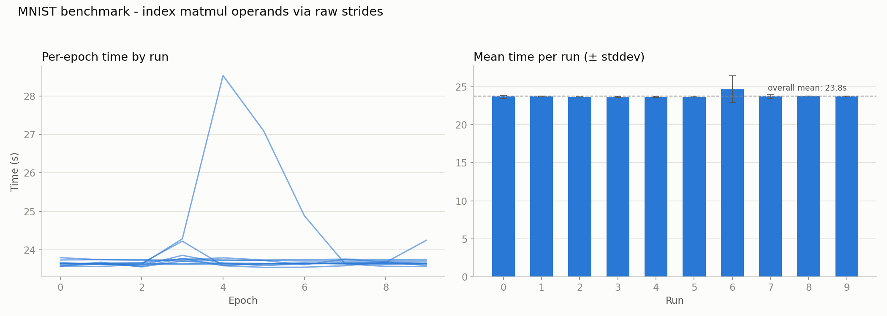

# 003 – matmul: eliminate at() overhead via raw strided indexing

**Period:** 2026-07-19
**Commit(s):** `ea570bb`

## Goal

Apply the fix identified in [002](002-matmul-at-hotspot.md) — `matmul`'s
triple loop spends ~76 % of total runtime inside `Tensor::at()` — and measure
the resulting effect on training throughput with the existing
`mnist_benchmark` methodology (see [001](001-mnist-warmup-calibration.md)).

## Setup

Same model, batch size, and adaptive-warmup benchmark methodology as before.
Baseline for comparison is the last measured run before this change,
commit `3b9e3ec` (~81.75 s/epoch, see [001](001-mnist-warmup-calibration.md)).

## Change

In `Tensor::matmul` (`src/tensor.cpp:334`), the two per-element `at({i,k})` /
`other.at({k,j})` calls are replaced by direct pointer arithmetic over the
raw backing buffers, using each operand's shape/stride/offset hoisted into
local variables once, before the loop:

```cpp
const float* lhs_data = data_->data() + offset_;
const float* rhs_data = other.data_->data() + other.offset();
const idx_t ls0 = stride_[0], ls1 = stride_[1];
const idx_t rs0 = other.stride()[0], rs1 = other.stride()[1];
...
lhs_data[i * ls0 + k * ls1] * rhs_data[k * rs0 + j * rs1];
```

This avoids `at()`'s repeated shape validation, per-dimension bounds
checking, and generic stride dot-product on every single element access.
Since the formula uses each operand's own strides directly rather than
assuming a dense row-major layout, it is correct for non-contiguous views
too (e.g. `.transpose()`, used heavily in the backward lambdas) without
needing a separate contiguous/non-contiguous code path. Verified against the
existing test suite (506 assertions, `tests/`) before benchmarking.

## Result



| | avg. of per-run medians | avg. of per-run means |
|---|---|---|
| baseline (`3b9e3ec`) | 81.75 s/epoch | 81.89 s/epoch |
| optimized (`ea570bb`) | 23.66 s/epoch | 23.77 s/epoch |
| **speedup** | **3.46×** | **3.45×** |

One run (run 6) shows a much larger stddev (1762 ms vs. single-digit-to-low-
hundreds ms elsewhere) and a visible spike in the per-epoch trace: epochs
4–6 jump to 28.5 s / 27.1 s / 24.9 s before dropping straight back to ~23.6 s
for the remaining epochs, with no such ramp in the surrounding runs or in
`warmup.csv` (which converges cleanly, unlike the gradual multi-epoch
thermal ramp seen in [001](001-mnist-warmup-calibration.md)). The shape — an
isolated 3-epoch bump that starts and ends abruptly mid-run — points to a
one-off external interruption (e.g. background OS activity) rather than a
systematic effect of this change. Run 6's own **median** (23629 ms) sits
right in line with every other run, confirming the run was typical except
for those three epochs. Rather than discarding the run, the aggregate
comparison above uses each run's median, which is robust to this kind of
localized outlier; note that it barely matters here in practice — the
mean-based comparison gives essentially the same speedup (3.45× vs. 3.46×),
since only 3 of 100 measured epochs were affected.

## Interpretation

A naive reading of [002](002-matmul-at-hotspot.md)'s "76 % of runtime in
`at()`" would predict, via Amdahl's law, a speedup up to
`1 / (1 - 0.76) ≈ 4.2×` if that share were eliminated entirely. The observed
3.46× is lower, for two reasons: first, the replacement code is not free —
each element still costs two multiplies and an add to compute the strided
offsets, just far less than `at()`'s full validation/bounds-check/stride-
loop machinery. Second, Amdahl's law assumes the remaining ~24 % (forward's
non-matmul work, all of backward's non-matmul work, `SGD::step`, data
loading) stays fixed in absolute time — as the matmul share shrinks, that
fixed remainder becomes a proportionally larger share of the new, smaller
total, capping the achievable speedup regardless of how cheap `matmul`
itself becomes.

## Conclusion / next steps

A single, targeted change against a profiler-confirmed hotspot yielded a
~3.46× training throughput improvement, without altering `matmul`'s
semantics (existing test suite still passes). Before picking the next
optimization target, the code should be re-profiled with
`mnist_profile.cpp` — the relative weight of `SGD::step`, data loading, and
the remaining `matmul` self-time has likely shifted now that `at()` no
longer dominates, and that new profile should drive the next iteration
(candidates discussed so far: cache-friendlier loop ordering in `matmul`,
i.e. i-k-j instead of i-j-k) rather than assuming the old profile still
applies.