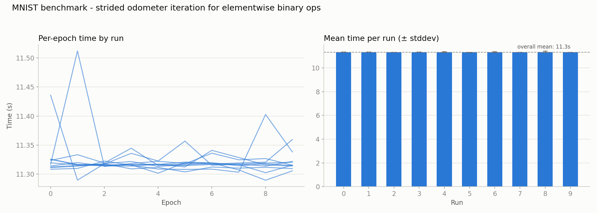

# 004 – elementwise binary ops: strided odometer iteration

**Period:** 2026-07-20
**Commit(s):** `97fe3ea`, `32302fb`, `d739073`

## Goal

The profile taken after [003](003-matmul-raw-stride-indexing.md) showed that
`operator+`/`operator-`/`operator*` and the `at(vector<idx_t> const&)`
overload they call combined for ~52 % of total runtime — more than
`matmul`'s own remaining 39.6 %. Apply the same class of fix (eliminate
per-element `at()`/index-rebuilding overhead) to the elementwise binary
operators and measure the effect.

## Setup

Same model, batch size, and benchmark methodology as before (see
[001](001-mnist-warmup-calibration.md)). Baseline for comparison is
[003](003-matmul-raw-stride-indexing.md)'s result (`ea570bb`, ~23.66 s/epoch
median).

## Change

`operator+`, `operator-`, `operator*`, `operator/` (`src/tensor.cpp:847` ff.)
previously allocated a fresh `std::vector<idx_t>` per output element via
`utils::flat_to_indices` and rebuilt the full stride dot-product through
`at()` on every element — the same problem `matmul` had, plus a per-element
heap allocation on top.

The fix is a new free function, `elementwise_binary` (anonymous namespace,
`src/tensor.cpp:40`), that walks the output shape with an incrementally
maintained multi-dimensional counter ("odometer"): a running flat offset per
operand is adjusted by the relevant stride when a dimension's index advances,
and reset when it overflows into the next-higher dimension — no
per-element allocation, no division/modulo, no `at()` call. Broadcasting
needs no special case: a stretched dimension simply has `stride == 0`, so it
contributes nothing to the offset regardless of how far the counter advances
along it. Templating on the combining operation (`std::plus<>`,
`std::minus<>`, `std::multiplies<>`, `std::divides<>`) keeps it inlinable
rather than paying for a type-erased call per element.

## Result

| | avg. of per-run medians |
|---|---|
| 003 (matmul raw-stride only) | 23.66 s/epoch |
| all four operators (`d739073`) | 11.32 s/epoch |
| **speedup vs. 003** | **2.09×** |
| **cumulative speedup vs. original baseline** | **7.22×** |

**A methodological catch worth recording:** the benchmark was first run
against a stale binary — `cmake`'s git-sha embedding had reconfigured after
`97fe3ea` (`operator+` only) but the library was never rebuilt against
`32302fb` (`-`, `*`, `/`) before that run, caught by comparing build artifact
mtimes against commit timestamps. That accidental "operator+ only" data point
turned out to be revealing rather than just a mistake to discard: it measured
**11.31 s/epoch — statistically indistinguishable from the all-four-operators
result (11.32 s/epoch, a 0.02 % difference, well within run-to-run noise)**.
Fixing `operator+` alone captured essentially the entire gain.

## Interpretation

The old profile weighted `operator+`, `operator-`, and `operator*` similarly
(13.7 %, 11.5 %, 12.1 %), which would suggest fixing only one of them should
recover only about a third of their combined share — yet fixing `operator+`
alone reproduced the full expected speedup. The likely explanation:
`operator+=` (`tensor.hpp:468`) is implemented in terms of `operator+`, and
`*meta->grad += ...` is exactly how every backward pass accumulates
gradients into every intermediate tensor across the whole autograd graph —
called far more pervasively throughout `backward()` than the direct
`operator-`/`operator*` call sites (used only at a handful of specific
places, e.g. the product rule term or the SGD update). A function's
per-call-site profile weight doesn't necessarily predict the impact of
fixing it once its cost is aggregated across every place it's transitively
invoked — the same lesson as the `-O3` inlining surprise in
[002](002-matmul-at-hotspot.md), here caused by call frequency rather than
compiler inlining.

## Conclusion / next steps

Three iterations in ([003](003-matmul-raw-stride-indexing.md), this one) now
compound to a **~7.22× speedup** over the original unoptimized baseline.
Since `-`, `*`, `/` turned out not to move the needle measurably in this
workload, don't assume that generalizes — a different model (e.g. one that
leans more on elementwise multiplication or division) could hit them much
harder. As always, the next step is to re-profile with `mnist_profile`
before picking the next target rather than assuming the current profile
still applies.
