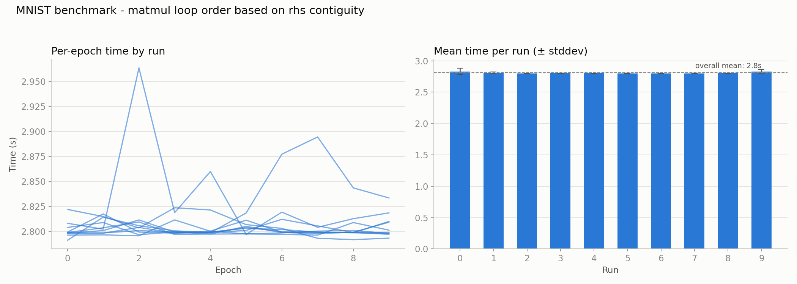

# 005 – matmul: dispatch loop order on rhs contiguity

**Period:** 2026-07-22
**Commit(s):** `47081dd`, `fb22481`

## Goal

The profile taken after [004](004-elementwise-odometer-iteration.md) showed
`matmul` back at 82.6 % self-time — no longer overhead (that was eliminated
in [003](003-matmul-raw-stride-indexing.md)), but real arithmetic work.
Before reaching for cache blocking or hand-written SIMD, check whether the
naive loop order (i-j-k) is even the right one for the shapes/strides this
model actually produces, and fix that first if not.

## Setup

Same model, batch size, and benchmark methodology as before. Baseline for
comparison is [004](004-elementwise-odometer-iteration.md)'s result
(`d739073`, ~11.32 s/epoch median).

## Analysis

Per training step, `matmul` is called 5 times, not 6: each `Linear` layer
contributes a forward call and a grad-weight call
(`lhs.transpose().matmul(grad_output)`), but grad-input
(`grad_output.matmul(rhs.transpose())`) is skipped for the first layer,
since the raw input batch never has `requires_grad` set — there is nothing
to propagate gradients into.

Costing each call by `rows·inner·cols`:

| Call | Shape | Cost |
|---|---|---|
| L1 forward | `[32,784]@[784,128]` | 3,211,264 |
| L1 grad-weight | `[784,32]@[32,128]` | 3,211,264 |
| L1 grad-input | — | *skipped* |
| L2 forward | `[32,128]@[128,10]` | 40,960 |
| L2 grad-input | `[32,10]@[10,128]` | 40,960 |
| L2 grad-weight | `[128,32]@[32,10]` | 40,960 |

Layer 1's two calls make up **~96 %** of total `matmul` work; Layer 2's
three calls are noise (~1.3 % each).

The deciding factor for which loop order is cache-friendly turned out to be
narrower than expected. For the order `for r: for i: for c: result[r,c] +=
lhs[r,i] * rhs[i,c]` (i-k-j), `lhs[r,i]` is loaded once per `(r,i)` pair and
reused as a scalar across the whole inner `c` loop — its own stride pattern
barely matters. What matters is whether `rhs`/`result` are contiguous along
`c`, i.e. whether `rhs`'s stride along its second dimension is 1.

Checking the three call shapes against that: **L1 forward and L1
grad-weight both have `rhs` contiguous along `c`**, despite `lhs` being a
plain tensor in one case and a `.transpose()` view in the other — so both of
the calls that actually matter want the *same* loop order. Only grad-input
(negligible cost here) has `rhs` transposed and wants the original i-j-k
order instead, which it already gets from the existing (correct, if
non-optimal for the other two cases) implementation.

## Change

`Tensor::matmul` (`src/tensor.cpp:370`) now branches on `rs1 == 1`
(`other.stride()[1]`, i.e. whether `rhs` is contiguous along its trailing
dimension):

- **`rs1 == 1`** (forward, grad-weight): new i-k-j loop, with `lhs[r,i]`
  hoisted into a local variable outside the innermost loop so it's loaded
  once per `(r,i)` instead of once per `(r,i,c)`.
- **otherwise** (grad-input): unchanged i-j-k loop from
  [003](003-matmul-raw-stride-indexing.md).

No new state on `Tensor` was needed — the dispatch reads directly off the
strides `matmul` already has in hand.

## Result

| | avg. of per-run medians |
|---|---|
| 004 (elementwise odometer only) | 11.32 s/epoch |
| loop-order dispatch (`47081dd`) | 2.80 s/epoch |
| **speedup vs. 004** | **4.04×** |
| **cumulative speedup vs. original baseline** | **29.17×** |

## Interpretation

Two things stand out. First, the win came from *dispatching* between two
loop orders rather than from finding one universally-best order — the
"transposed operand" framing from the original hypothesis was slightly
wrong: what actually determines the right order is `rhs`'s contiguity
specifically, not which operand (if either) is transposed. `lhs`'s layout
turned out to be nearly irrelevant for the i-k-j order, since it's only
ever read as a per-`(r,i)` scalar there.

Second, a 4× speedup from a loop reorder (no new overhead eliminated, no
SIMD, no threading — just better memory access order for existing scalar
code) is a reminder of how much the naive i-j-k order was leaving on the
table purely through cache misses on `rhs`. This sets a useful reference
point for judging how much headroom is realistically left for hand-written
SIMD/blocking in the next iterations.

## Conclusion / next steps

Four iterations in ([003](003-matmul-raw-stride-indexing.md),
[004](004-elementwise-odometer-iteration.md), this one) now compound to a
**~29.17× speedup** over the original unoptimized baseline. Per the earlier
plan, before reaching for cache blocking or a hand-written NEON kernel: check
whether `-O3` already auto-vectorizes the new i-k-j loop, and whether adding
`__restrict` to `lhs_data`/`rhs_data`/`result`'s buffer pointer unlocks
vectorization the compiler currently can't prove is safe (pointer aliasing
between `result` and the operands can't be ruled out without it). Re-profile
with `mnist_profile` first to confirm `matmul` is still the dominant cost
before committing to that work.
