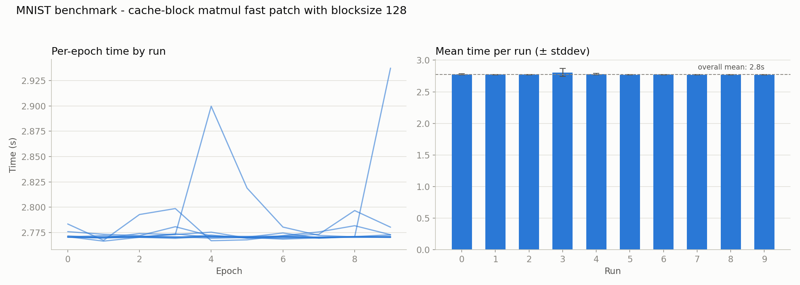
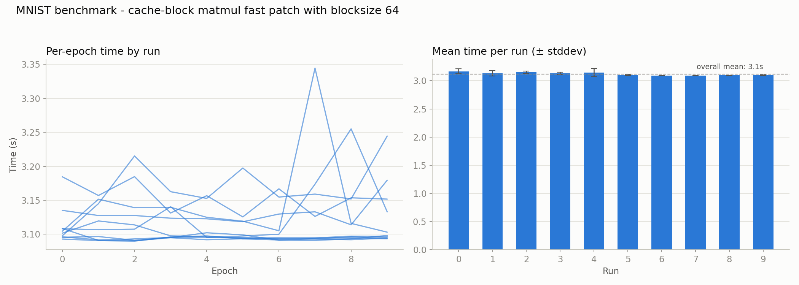
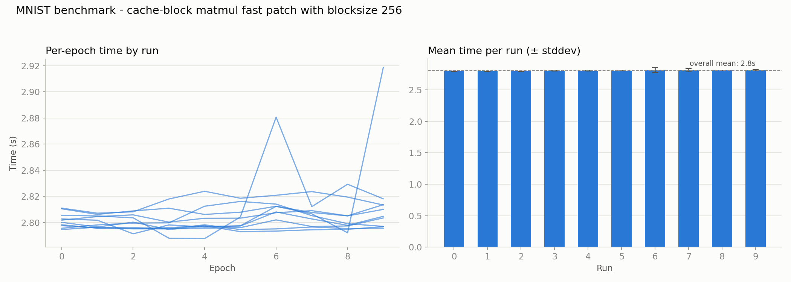

# 007 – matmul: cache-blocking evaluation (BLOCK=64/128/256)

**Period:** 2026-07-23
**Commit(s):** `9e1c020`, `631c9d6`, `6256a8c`

## Goal

[006](006-matmul-autovectorization-check.md) confirmed `matmul`'s inner
loops are already auto-vectorized with no aliasing overhead, and predicted
cache blocking would have a smaller ceiling than the previous overhead-
elimination iterations. Test that directly: add tiling to the i-k-j fast
path and measure whether it moves throughput at all, and if so, find a good
block size empirically rather than trusting the L1D-derived theoretical
value (128, see the derivation discussion preceding this iteration) blindly.

## Setup

Same model, batch size, and benchmark methodology as before. Baseline for
comparison is [005](005-matmul-loop-order-dispatch.md)'s result (`47081dd`,
2803.13 ms/epoch avg. of medians, before any blocking).

## Change

`Tensor::matmul`'s i-k-j fast path (`src/tensor.cpp:399`) now tiles the `c`
and `i` loops in steps of `MATMUL_BLOCK` (a file-scope constant,
`src/tensor.cpp:26`), with `r` iterating fully inside each `(c0, i0)` tile so
the corresponding `rhs` tile stays resident across all 32 batch rows instead
of being re-scanned from scratch per row.

## Result

| Block size | avg. of per-run medians | vs. baseline (no blocking) |
|---|---|---|
| baseline, no blocking (`47081dd`) | 2803.13 ms | — |
| 64 | 3114.10 ms | **+11.1 % (slower)** |
| 128 | 2771.38 ms | −1.1 % |
| 256 | 2802.21 ms | ±0.0 % |

`BLOCK=128` and `BLOCK=256` are statistically indistinguishable from the
unblocked baseline (well within typical run-to-run noise seen in earlier
iterations, e.g. the ~1.8 s spread from a single outlier run in
[003](003-matmul-raw-stride-indexing.md)). `BLOCK=64` is measurably
*slower* — the extra loop nesting and `std::min` boundary handling cost more
than the tiling saves at that size.

## Interpretation

This is a negative result, and it's the expected one given
[006](006-matmul-autovectorization-check.md)'s reasoning: Layer 1's weight
matrix (784×128×4 B ≈ 392 KiB) already fits comfortably inside the M2's L2
cache (16 MiB on P-cores) with room to spare. Blocking targets promoting
data from L2 into L1 residency — but at this problem size, the full
working set was never spilling to RAM in the first place, and the
difference between an L2 hit and an L1 hit, while real, is apparently small
enough here to be swamped by the loop-management overhead blocking adds.
`BLOCK=64` makes that overhead worse without a bigger cache-locality payoff
to compensate, since the tiles are already far smaller than needed.

The likely conclusion: for this model's matrix sizes, `matmul`'s remaining
cost is dominated by raw (already-vectorized) FMA throughput, not by memory
access pattern — cache blocking has essentially nothing left to fix here.
That would very likely change for larger matrices (bigger hidden layers,
larger batch sizes) whose working set actually exceeds L2, but this MLP's
784×128 weight matrix simply isn't big enough to expose the effect blocking
is meant to address.

## Conclusion / next steps

`MATMUL_BLOCK=128` is kept (not worse than baseline, and the code is no
more complex than any other block size), but blocking should not be
expected to contribute meaningfully to future speedups on this model. This
is worth remembering if the roadmap ever moves to larger networks — the
technique isn't wrong, it just has no problem to solve at this scale.

Before further hand-tuning: re-profile with `mnist_profile` to see where
`matmul`'s remaining cost (and the rest of the training step) actually sits
now, rather than assuming the [002](002-matmul-at-hotspot.md)/[006](006-matmul-autovectorization-check.md)
picture still holds after four iterations of changes. That result should
decide between the two remaining candidates: a hand-written NEON
micro-kernel (smaller expected win now that auto-vectorization is confirmed
already-good, but still a worthwhile exercise on its own terms) versus
moving on to multi-threading, the next major item on the roadmap.
