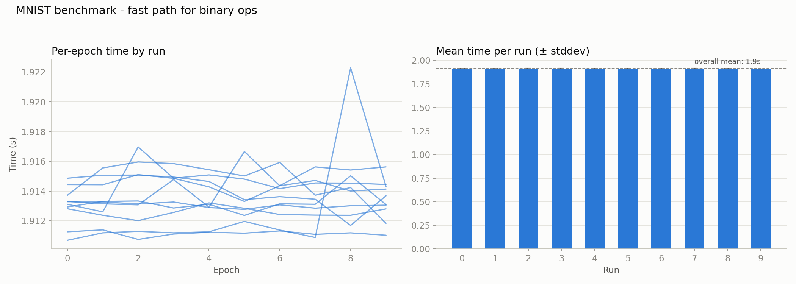

# 009 – elementwise binary ops: branch-free fast path

**Period:** 2026-07-26 – 2026-08-06
**Commit(s):** `692eed2`

## Goal

[008](008-elementwise-still-scalar.md) found that `elementwise_binary`'s
odometer loop, despite eliminating `at()` and per-element allocation in
[004](004-elementwise-odometer-iteration.md), never actually vectorizes —
the data-dependent carry branch blocks it. Add a branch-free fast path for
the common case (matching shapes, no broadcasting, both operands
contiguous) and measure the effect.

## Setup

Same model, batch size, and benchmark methodology as before. Baseline for
comparison is [007](007-matmul-cache-blocking-evaluation.md)'s kept result
(`9e1c020`, `MATMUL_BLOCK=128`, 2771.38 ms/epoch avg. of medians) — no
`matmul` changes happened between 007 and this iteration, so it's the right
reference point.

## Change

`operator+`/`-`/`*`/`/` (`src/tensor.cpp:874` ff.) each now compute
`fast_path = lhs.is_contiguous() && rhs.is_contiguous() && rhs.shape() ==
lhs.shape()` and pass it to `elementwise_binary`, which branches once
(outside the hot loop) instead of per element:

```cpp
if (fast_path) {
  for (idx_t i = 0; i < num_elements; i++) {
    new_data[i] = op(a_data[i], b_data[i]);
  }
} else {
  // unchanged odometer walk for genuine broadcasting
}
```

Calling `broadcast()` unconditionally first (rather than trying to skip it
in the fast case) turned out to be unnecessary complexity to avoid: when
shapes already match, `broadcast()` (`src/tensor.cpp:839`) leaves shape and
stride untouched — it's a free pass-through, not a copy — so there's no cost
to always calling it and checking `is_contiguous()` on the result.

Verified with the same discipline as [006](006-matmul-autovectorization-check.md):
assembly inspection (not just the compiler's vectorization remark, which
had already proven misleading once in this project) confirms real NEON
code for the fast path — `fadd.4s`, 4× unrolled, 16 floats per loop
iteration, no nested loop at all:

```asm
LBB66_65:                        ; single loop, no nested carry loop
    ldp  q0, q1, [x9, #-32]      ; load 8 floats from a_data
    ldp  q2, q3, [x9], #64
    ldp  q4, q5, [x10, #-32]     ; load 8 floats from b_data
    ldp  q6, q7, [x10], #64
    fadd.4s v0, v0, v4
    fadd.4s v1, v1, v5
    fadd.4s v2, v2, v6
    fadd.4s v3, v3, v7
    stp  q0, q1, [x11, #-32]
    stp  q2, q3, [x11], #64
```

## Result



| | avg. of per-run medians |
|---|---|
| 007 (`9e1c020`, before this fix) | 2771.38 ms |
| fast path (`692eed2`) | 1913.38 ms |
| **speedup vs. 007** | **1.45×** |
| **cumulative speedup vs. original baseline** | **~42.7×** |

The per-epoch trace is unusually clean for this project — tight clustering
around 1.91–1.92 s across all ten runs, no thermal ramp, one small blip at
epoch 8 in a single run. No exclusions or caveats needed for this one.

**A methodological detour worth recording:** two profiling attempts along
the way were misleading before this result was in hand. The first
(`mnist_profile_f2d678`) showed almost no improvement in `operator+`/`-`'s
share — it turned out to be built at the docs-only commit right before
`692eed2`, i.e. still running the old scalar code. The second, after
rebuilding, showed `matmul` ballooning to 43.7% of a *longer* total runtime
than before, which looked like a regression — but `build-release`'s
`CMakeCache.txt`, compile flags, and object-file timestamps all confirmed a
correct, current, `-O3` build. The likely explanation is background load on
the machine at the time possibly pushing the process onto E-cores (64 KiB
L1D vs. 128 KiB on P-cores, much lower clocked) — neither profiling run was
trustworthy, and the benchmark above was only taken once the machine was
free. Same lesson as [001](001-mnist-warmup-calibration.md)'s thermal-noise
saga, different noise source.

## Interpretation

Smaller relative win than [005](005-matmul-loop-order-dispatch.md)'s 4.04×,
which fits expectations: that iteration fixed a badly cache-unfriendly
access pattern in the single most expensive function, while this one
removes a per-element branch across four functions whose combined weight,
while large (47.8% in [008](008-elementwise-still-scalar.md)), was already
partly offset by `Tensor::sum` and other unaddressed costs that this change
doesn't touch. Still, 1.45× from "stop branching per element" alone,
verified via real NEON output rather than a trusted-but-wrong compiler
remark, is a solid result consistent with the project's running theme:
overhead elimination and enabling auto-vectorization have so far
outperformed the more elaborate techniques (cache blocking, in
[007](007-matmul-cache-blocking-evaluation.md), moved nothing).

## Conclusion / next steps

Cumulative speedup since the original unoptimized baseline is now **~42.7×**
across five substantive changes (003, 004, 005, 007's negative result
included as a decision, 009). Before picking the next target: get a clean
profile on an idle machine — the two contaminated attempts during this
iteration are not a basis for deciding anything. `Tensor::sum` (11.7–12.4%
in every profile since [004](004-elementwise-odometer-iteration.md), never
addressed) is the standing candidate; whether it's still worth it depends on
where the now-shrunk elementwise/matmul costs leave it proportionally.
