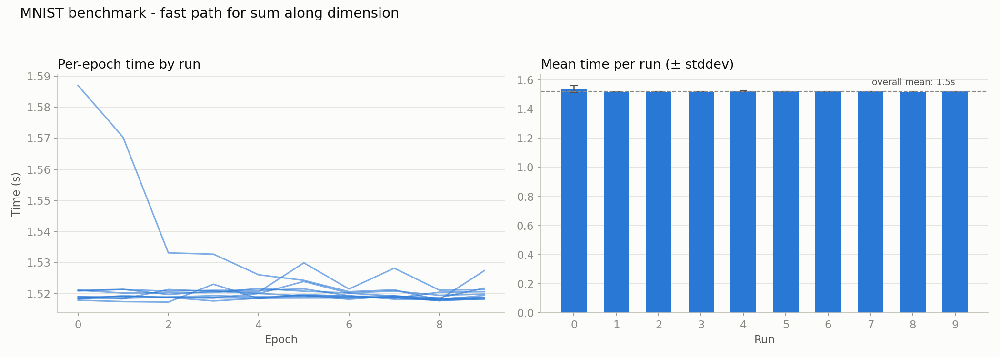

# 011 – sum(dim, keep_dim): outer × reduce × inner fast path

**Period:** 2026-08-09
**Commit(s):** `944820d`

## Goal

[010](010-post-fast-path-reprofile.md) identified `Tensor::sum(idx_t dim,
bool keep_dim)` as the same class of bug already fixed elsewhere: a
per-element `flat_to_indices` call that heap-allocates a `std::vector` for
every element, used by `reduce_grad_to_shape` on every backward pass that
undoes broadcasting (e.g. the bias gradient in `Linear::forward`). Apply the
same "avoid per-element index bookkeeping" fix and measure the effect.

## Setup

Same model, batch size, and benchmark methodology as before. Baseline for
comparison is [009](009-elementwise-fast-path.md)'s result (`692eed2`,
1913.38 ms/epoch avg. of medians).

## Change

`Tensor::sum(dim, keep_dim)` (`src/tensor.cpp:676`) gains a contiguous fast
path based on decomposing the input's dimensions relative to `dim` into
three groups: `outer` (dimensions before `dim`), `reduce` (`shape_[dim]`
itself), and `inner` (dimensions after `dim`). For a contiguous tensor, the
flat offset of any element is exactly `o*(reduce*inner) + r*inner + k`, and
critically the *output* offset is `o*inner + k` regardless of `keep_dim` —
a size-1 dimension doesn't change the physical layout, only the reported
shape. That turns the reduction into three flat, unbranched loops:

```cpp
for (idx_t o = 0; o < outer; o++) {
  float* out_row = &new_data[o * inner];
  for (idx_t r = 0; r < reduce; r++) {
    const float* in_row = data + o * reduce * inner + r * inner;
    for (idx_t k = 0; k < inner; k++) {
      out_row[k] += in_row[k];
    }
  }
}
```

The innermost loop (`out_row[k] += in_row[k]`) is the same branch-free,
contiguous-accumulate pattern as [009](009-elementwise-fast-path.md)'s
elementwise fast path — same reason to expect it vectorizes the same way.
This single loop structure handles `dim` at any position (first, last, or
in between) and any rank, with no special-casing: `outer` and/or `inner`
simply evaluate to `1` at the boundaries. The existing `flat_to_indices`
path is kept as the fallback for non-contiguous inputs.

## Result



| | avg. of per-run medians |
|---|---|
| 009 (`692eed2`, before this fix) | 1913.38 ms |
| `sum` fast path (`944820d`) | 1520.11 ms |
| **speedup vs. 009** | **1.26×** |
| **cumulative speedup vs. original baseline** | **~53.8×** |

Clean run: tight clustering (~1.52 s) across all ten runs, only the usual
brief cold-start bump in run 0's first two epochs.

A subsequent profile (not repeated in full here, informal check) showed
`Tensor::sum` dropping from 16.1 % self-time to effectively nothing
(~0.2 %) — consistent with this being a full fix rather than a partial
improvement, and matching the pattern of every other "eliminate per-element
allocation" fix in this project so far.

## Interpretation

Same story as [003](003-matmul-raw-stride-indexing.md)/[009](009-elementwise-fast-path.md):
the win comes from recognizing that a seemingly N-dimensional problem
reduces to simple flat arithmetic once contiguity is assumed, rather than
from anything algorithmically clever. The `outer`/`reduce`/`inner`
decomposition is the standard way axis-reductions are implemented in
production tensor libraries (NumPy, PyTorch) for exactly this reason — it
isn't a novel technique, but applying it here closes the last of the
"per-element heap allocation" bugs identified across this whole
optimization arc (matmul in 003, elementwise ops in 004/009, now sum).

## Conclusion / next steps

Cumulative speedup since the original unoptimized baseline is now
**~53.8×**. With `sum` fixed, the profile from the investigation preceding
this entry showed `matmul` (~50%) and `operator*` (~25%) as the two
remaining large costs — `operator*`'s share is suspected to come largely
from `SGD::step()`'s scalar-tensor broadcast (`lr * grad`), which cannot
use the existing "matching shapes" fast path regardless of implementation
and would need a dedicated scalar-broadcast fast path. That hypothesis
should be confirmed (via the call tree, not assumed) before deciding on a
fix. `matmul` itself is close to exhausted for single-threaded gains
(overhead, cache, and vectorization all already addressed in
003/005/006/007) — a hand-written register-blocked SIMD kernel remains a
worthwhile exercise but with a smaller expected ceiling (~1.5–3×) than the
fixes so far, and multi-threading (the next roadmap phase) should follow
both, not precede them.
