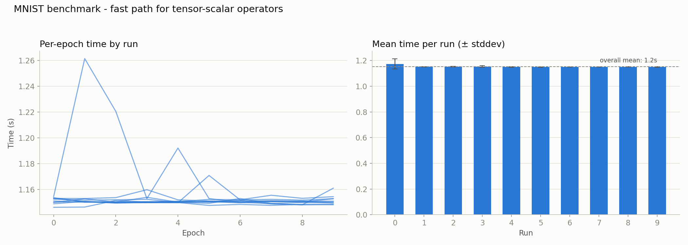

# 012 – tensor-scalar operators: elementwise_scalar fast path

**Period:** 2026-08-19
**Commit(s):** `b8e2295`, `ebbe426`, `1dbb677`

## Goal

[010](010-post-fast-path-reprofile.md) flagged `operator*` (~19.7–25.5% of
runtime across two profiles) as likely dominated by `SGD::step()`'s scalar
broadcast (`lr * grad`), which can never take the "matching shapes" fast
path added for tensor-tensor ops in [009](009-elementwise-fast-path.md) —
`{1}`-shaped `lr` against a full parameter gradient is an inherent
broadcast, regardless of implementation. Confirm that and add a dedicated
fast path for the tensor-scalar case.

## Setup

Same model, batch size, and benchmark methodology as before. Baseline for
comparison is [011](011-sum-outer-reduce-inner.md)'s result (`944820d`,
1520.11 ms/epoch avg. of medians).

## Change

All four tensor-scalar operator overloads (`tnsr ± sclr`, `sclr ± tnsr`,
`tnsr * sclr`, `sclr * tnsr`, `tnsr / sclr`, `sclr / tnsr` —
`src/tensor.cpp`, formerly inline in `tensor.hpp` routing through
`Tensor::from_data({sclr}, {1})` and the general broadcasting path) now go
through a new free function, `elementwise_scalar`, mirroring
`elementwise_binary`'s split: a branch-free `std::ranges::transform` for
contiguous input, falling back to `flat_to_indices` + stride dot-product
otherwise. No broadcasting machinery is invoked at all — a scalar was never
a real second operand needing shape reconciliation, just a second value fed
into the same op at every position.

Backward closures were rewritten by hand per operator (unlike
`elementwise_binary`'s single shared implementation, the four operators'
derivatives differ): `d(tnsr±sclr)/dtnsr = ±1`, `d(tnsr*sclr)/dtnsr = sclr`,
`d(sclr/tnsr)/dtnsr = -sclr/tnsr²` (quotient rule), `d(tnsr/sclr)/dtnsr =
1/sclr`.

## Result

| | avg. of per-run medians |
|---|---|
| 011 (`944820d`, before this fix) | 1520.11 ms |
| `elementwise_scalar` fast path (`1dbb677`) | 1150.94 ms |
| **speedup vs. 011** | **1.32×** |
| **cumulative speedup vs. original baseline** | **~71.0×** |

A follow-up profile (clean, idle machine, "Thermal State: Nominal") confirms
the hypothesis directly. Self-time breakdown, total runtime 5.83 s (down
from 7.98 s pre-fix):

| Function | Self-time |
|---|---|
| `matmul` | 67.4% |
| `shared_ptr::allocate_shared` | 6.8% |
| `operator+` | 4.5% |
| `operator-` | 3.8% |
| `Tensor::data()` | 3.2% |
| `operator*` (scalar + tensor combined) | **2.6%** (was ~19.7–25.5%) |
| everything else | each < 2% |

## Interpretation

The hypothesis from [010](010-post-fast-path-reprofile.md) was correct:
`operator*`'s cost was structural, not implementation quality — no amount
of tuning `elementwise_binary`'s matching-shape fast path could have
touched it, because the dominant caller never took that path in the first
place. Recognizing *which* fast path condition actually applies to a given
call site mattered more here than how well any single fast path was
written.

With `operator*` fixed, no remaining function other than `matmul` accounts
for more than ~7% of runtime — the profile is about as flat as it's going
to get without touching `matmul` itself. This effectively closes out the
single-threaded overhead-elimination phase of this project: every
`at()`/per-element-allocation/broadcast-mismatch bug identified via
profiling since [002](002-matmul-at-hotspot.md) has now been addressed
(matmul in 003/005, elementwise tensor-tensor ops in 004/009, `sum(dim)` in
011, tensor-scalar ops here).

## Conclusion / next steps

Cumulative speedup since the original unoptimized baseline is now
**~71.0×**, entirely from single-threaded fixes with no change in numerical
behavior (verified throughout by the existing test suite, now also
covering tensor-scalar operator gradients directly per
[the preceding test-coverage commit](../../tests/grad_check.cpp) — added
specifically because the earlier version of this fix briefly introduced two
sign errors in the `-` scalar backward passes that no existing test caught).

With `matmul` now the only function worth optimizing further, and its
overhead/cache-locality/auto-vectorization already addressed in
[003](003-matmul-raw-stride-indexing.md)/[005](005-matmul-loop-order-dispatch.md)/[006](006-matmul-autovectorization-check.md)/[007](007-matmul-cache-blocking-evaluation.md),
the two remaining candidates are: a hand-written register-blocked NEON
kernel for `matmul` (smaller expected ceiling, ~1.5–3×, but the planned
learning exercise), or moving on to multi-threading, the next roadmap
phase. Per the standing plan, single-threaded `matmul` work should come
first — parallelizing before exhausting sequential gains just multiplies
inefficiency across cores.
