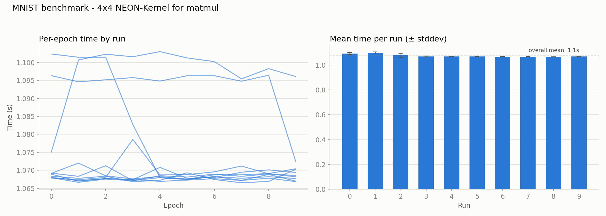

# 013 – matmul: hand-written 4×4 NEON register-blocked kernel

**Period:** 2026-08-22
**Commit(s):** `e6b1cee`

## Goal

Per [012](012-elementwise-scalar-fast-path.md)'s conclusion, `matmul` is the
only remaining function above ~7% of runtime, and its overhead/cache-
locality/auto-vectorization were already addressed in
[003](003-matmul-raw-stride-indexing.md)/[005](005-matmul-loop-order-dispatch.md)/[006](006-matmul-autovectorization-check.md)/[007](007-matmul-cache-blocking-evaluation.md).
Write a hand-tuned NEON micro-kernel for the `rs1==1` fast path to see how
much further single-threaded `matmul` can go — as a learning exercise, with
[006](006-matmul-autovectorization-check.md)'s finding (compiler already
emits width-4 `fmla` with no aliasing overhead) setting the expectation that
the ceiling here is smaller than the earlier overhead-elimination wins.

## Setup

Same model, batch size, and benchmark methodology as before. Baseline for
comparison is [012](012-elementwise-scalar-fast-path.md)'s result
(`1dbb677`, 1150.94 ms/epoch avg. of medians).

## Change

The `rs1==1` branch of `Tensor::matmul` (`src/tensor.cpp`) now tiles the
output into 4×4 blocks and, for each block, accumulates the full reduction
(`inner` elements) in four NEON registers before writing the result back
once — instead of the auto-vectorized version's read-modify-write to
`result` on every reduction step. Core intrinsics: `vdupq_n_f32` (zero the
accumulators), `vld1q_f32`/`vfmaq_n_f32` per reduction step (load a
contiguous 4-wide `rhs` slice, fused-multiply-accumulate against a
broadcast `lhs` scalar), `vst1q_f32` once at the end.

Two correctness issues surfaced and were fixed before this was safe to ship:

1. **An early version copied `result`'s buffer into a local
   `std::vector<float>` and wrote into the copy** — the kernel computed
   correctly but the output never reached the actual returned `Tensor`,
   which stayed all zeros. Fixed by writing through
   `result.data_->data()` directly (a raw pointer into the real buffer,
   `matmul` being a member function has access to any `Tensor`'s private
   `data_`).
2. **Unconditional 4-wide tiling reads/writes past the buffer when `rows`
   or `cols` isn't a multiple of 4** — caught immediately by ASan on the
   existing `[2,3]@[3,2]` unit test (`tensor_test.cpp:416`), not a
   hypothetical future-model concern. Fixed with a per-tile size check
   (`mr = min(4, rows - r0)`, `nr = min(4, cols - c0)`): full tiles
   (`mr == nr == 4`) take the plain SIMD path above; edge tiles fall
   through to a variant using two small helpers, `load_n`/`store_n`, that
   load/store 1–3 lanes via `vld1q_lane_f32`/`vst1q_lane_f32` with
   `[[fallthrough]]` — zero-padding unused lanes on load (so the FMA math
   stays branch-free across all 4 lanes) and simply not writing them back
   on store. `inner` needs no such handling — the reduction loop is scalar
   over `k` regardless of tile size, only `rows`/`cols` determine tile
   bounds.

The `else` branch (grad-input, negligible cost per
[005](005-matmul-loop-order-dispatch.md)) and the old `MATMUL_BLOCK`
cache-tiling loop (found to be a no-op in
[007](007-matmul-cache-blocking-evaluation.md)) were left alone /
removed respectively — this kernel replaces the tiling loop's body
entirely rather than nesting inside it, per the earlier discussion about
not compounding two untested-together techniques.

## Result

| | avg. of per-run medians |
|---|---|
| 012 (`1dbb677`, before this change) | 1150.94 ms |
| 4×4 NEON kernel (`e6b1cee`) | 1074.08 ms |
| **speedup vs. 012** | **1.07×** |
| **cumulative speedup vs. original baseline** | **~76.1×** |

## Interpretation

The modest speedup is the expected outcome, not a disappointing one:
[006](006-matmul-autovectorization-check.md) already established that
`-O3` was emitting real width-4 `fmla` code with zero aliasing overhead
before any of this. The hand-written kernel's actual improvement comes
from a narrower source than "vectorizing" — cutting `result`'s memory
traffic from once per reduction step to once per completed tile — and that
effect was smaller here than the register/cache work in
[005](005-matmul-loop-order-dispatch.md)/[007](007-matmul-cache-blocking-evaluation.md)
already predicted it would be, since [007](007-matmul-cache-blocking-evaluation.md)
had already shown this model's working set doesn't stress memory
bandwidth much at this scale.

The two bugs are worth noting for their own sake: neither was a SIMD-
specific mistake — a stale copy instead of a reference, and an unguarded
fixed-size tile assumption — are exactly the class of bug any blocked/
tiled algorithm is prone to, SIMD or not. The out-of-bounds tiling bug in
particular was caught immediately by the *existing* test suite (via ASan)
precisely because that suite includes small, non-multiple-of-4 shapes —
a reminder that correctness-by-construction (tests covering shapes beyond
the one model you're optimizing for) matters as much for a hand-written
kernel as a general-purpose `matmul` does for any other caller.

## Conclusion / next steps

Cumulative speedup since the original unoptimized baseline is now
**~76.1×**. This closes out the single-threaded optimization arc for
`matmul` — overhead (003), loop order (005), auto-vectorization confirmed
sufficient (006), cache blocking ruled out (007), and now register-blocked
SIMD tried with the expected small ceiling (013). Per the standing plan,
the next major phase is multi-threading — parallelizing across the batch
dimension or output tiles — now that sequential `matmul` has been pushed
about as far as is reasonable at this problem size.
